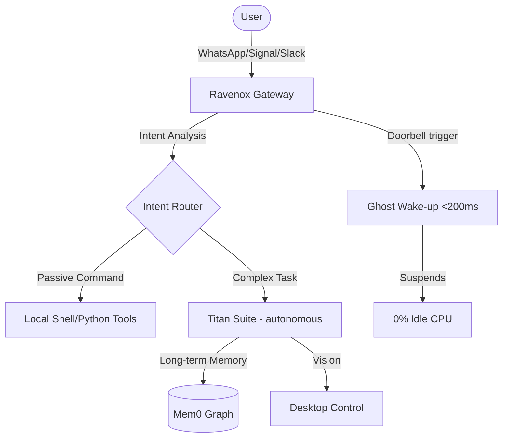

<p align="center">
  
</p>

# Ravenox 🐦‍⬛🚀
### *The Sovereign Intelligence System*

[](LICENSE)
[]()
[]()
[]()

**Ravenox** is a high-performance, high-autonomy personal AI assistant distribution. Designed for developers and power users, it prioritizes **sovereignty, speed, and extreme resource efficiency**. By merging standard bot capabilities with heavy-duty LLM reasoning, Ravenox acts as a "Ghost" in your shell—ready to wake up in milliseconds and execute complex tasks across any platform.

---

> [!IMPORTANT]
> **Lineage & Acknowledgement**: Ravenox is a performance-tuned evolution of the Ravenox project. We extend our gratitude to the original Ravenox contributors for the foundational gateway and modular architecture.

---

## 🛠️ System Requirements (Specs)

Ravenox is designed to scale from micro-hardware to powerful servers.

| Tier | Hardware Example | RAM | OS | Use Case |
| :--- | :--- | :--- | :--- | :--- |
| **Micro (Ghost)** | Raspberry Pi Zero / ESP32 | **64MB - 128MB** | Linux (Alpine/Lite) | Messaging, Automation, Basic AI |
| **Standard** | VPS / Old Laptop / Mac Mini | **512MB - 2GB** | Linux / macOS / WSL | Web Research, Multi-channel, Plugins |
| **Titan (High-Autonomy)** | Desktop PC / Cloud Instance | **4GB+** | Any (Docker Recommended) | Computer Vision, Mem0 Graph, Autonomous Tasks |

---

## 📡 Connection Guide

Ravenox supports 15+ messaging providers. Here is how you connect the most popular ones:

### 🟢 WhatsApp (Raven Evolution)
Ravenox maintains **100% feature parity with Space-MD**. All commands, menus, and settings are preserved and optimized.
1.  Run `ravenox channels login`.
2.  A **QR Code** will appear in your terminal.
3.  Open WhatsApp on your phone → **Linked Devices** → **Link a Device** → Scan the QR.
4.  *Ravenox is now active as your digital shadow.*

### 🔵 Telegram
1.  Message [@BotFather](https://t.me/botfather) to create a bot and get your **API Token**.
2.  Run `ravenox channels add --channel telegram --token <YOUR_TOKEN>`.
3.  Message your bot to start the session.

---

## 🏗️ System Architecture


---

## 🟢 WhatsApp Specialized Command Surface
Ravenox inherits the legendary **Space-MD** categorical menu, providing modular control over your digital environment.

### 📂 Settings Control (Prefix: `.`)
Uses deterministic logic—works 100% reliably even without AI tokens.

| Command | Capability |
| :--- | :--- |
| `.mode` | Toggles between Public/Private/Dormant operation. |
| `.alwaysonline` | Keeps your identity visible 24/7. |
| `.anticall` | Automatically deflections intrusive calls. |
| `.chatbot` | Activates/Deactivates the high-autonomy LLM responder. |
| `.setbotname` | Renames your Ravenox instance locally. |

---

## 📦 Sovereign Installation

The fastest way to get Ravenox running on your machine (Linux, macOS, or WSL):

### ⚡ The One-Line Setup
```bash
curl -sSL https://raw.githubusercontent.com/imranshiundu/Ravenox/main/scripts/install.sh | bash
```

### 🛠️ Manual Installation
```bash
git clone https://github.com/imranshiundu/Ravenox.git && cd Ravenox
./scripts/install.sh
```

---

## 👥 Maintenance & Governance
Ravenox is directed and maintained by **Imran Shiundu (Lead Architect)**. 

---
<p align="center">
  <i>"Control is silent. Power is invisible."</i><br>
  <b>Ravenox © 2026</b>
</p>
